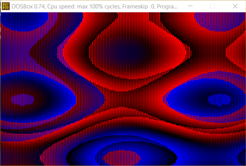

# Plas115
Plasma in 115 bytes for DOS in FASM

## seriously why
Just because it's fun to get into FASM, write some x86 code and try to achieve what the old demosceners did.

### literally what
This is really two tasks, 1) do a plasma in 16-bit assembly 2) make it tiny. So far I can't see a way to get it smaller than 115 bytes without losing quality but I keep trying.

For a tiny plasma, we omit any exit and timing logic, so the only way to quit is to close DOSBox. We also omit green from the palette because that adds more commands that we really don't need, red/blue do fine. EMU8086 (microprocessor emulator with integrated assembler) is really helpful as debugging 16-bit assembly pretty much isn't happening.

     

